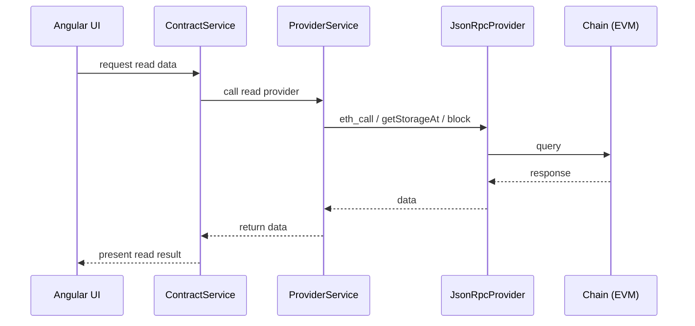
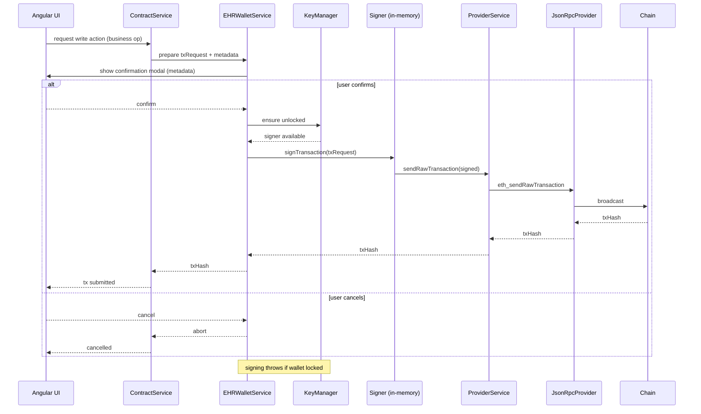
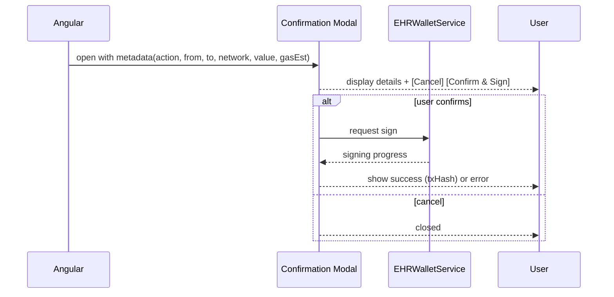
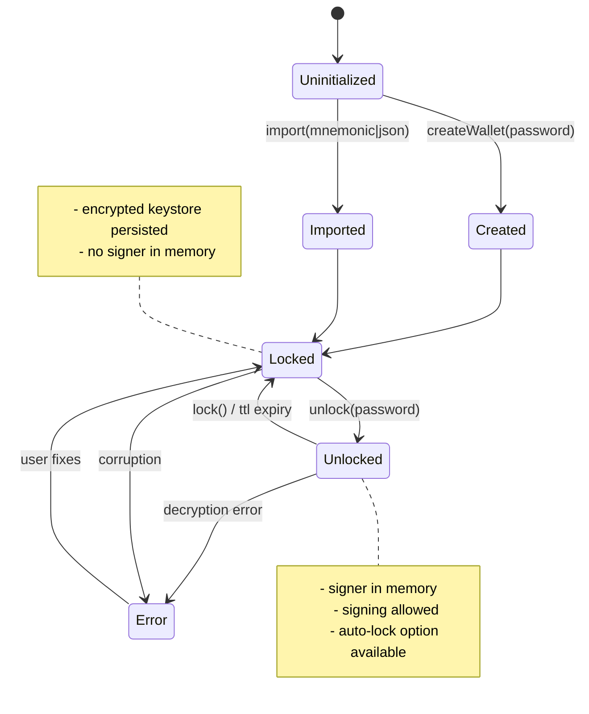

# EHR Wallet Architecture

This document contains Mermaid diagrams and brief explanations covering the EHR Wallet architecture, component responsibilities, security boundary, read/write transaction flows, transaction confirmation flow, lock/unlock lifecycle, and migration strategy from MetaMask. It is self-contained and does not require MetaMask, ERC‑4337, or hosted wallet infra.

---

## 1. High-level Architecture

```mermaid
flowchart TB
  subgraph UI [Angular UI]
    A[Angular Components\n(Transaction modal, Wallet UI)]
  end

  subgraph AppService [Application Services]
    B[EHRWalletService\n(create/import/unlock/lock/sign)]
    C[KeyManager\n(encrypted storage, in-memory signer lifecycle)]
    D[ProviderService\n(JsonRpcProvider read-only/write)]
    E[ContractService\n(ABI, contract ops)]
  end

  subgraph Ethers [ethers.js]
    F[Wallet/Signer]
  end

  subgraph RPC [JsonRpcProvider]
    G[Anvil / RPC Node]
  end

  subgraph Chain [EVM & Contracts]
    H[EHR Smart Contracts]
  end

  A -->|calls| E
  A -->|wallet actions| B
  B --> C
  B --> F
  F --> D
  E --> D
  D --> G
  G --> H
```

*Notes:* UI never accesses private keys. EHRWalletService is the app-facing wallet abstraction. ProviderService provides a read-only provider for ContractService and a broadcast channel for signed transactions.

---

## 2. Component Responsibilities (compact)

```mermaid
flowchart LR
  subgraph Wallet\nResponsibilities
    W1[Create / Import wallet]
    W2[Lock / Unlock]
    W3[Sign message / tx (with confirm UI)]
    W4[Address retrieval]
    W5[Encrypt / Decrypt keys]
  end

  subgraph Provider\nResponsibilities
    P1[JsonRpcProvider (read-only)]
    P2[Broadcast txs]
    P3[Chain ID & block queries]
  end

  subgraph Contract\nResponsibilities
    C1[ABI & addresses]
    C2[Read-only methods (use provider)]
    C3[Write methods (require signer)]
    C4[Map EHR business ops to tx/data]
  end

  Wallet --> Provider
  Contract --> Provider
  Wallet --> Contract
```

---

## 3. Security Boundary

```mermaid
flowchart LR
  subgraph Trusted[Trusted (Private key boundary)]
    T1[EHRWalletService]
    T2[KeyManager (encrypted storage + in-memory signer)]
    T3[In-memory Signer]
  end

  subgraph Untrusted[Untrusted / External]
    U1[Angular UI (no keys)]
    U2[Backend servers]
    U3[Telemetry / Logs]
    U4[Provider / RPC nodes]
  end

  U1 -->|requests sign| T1
  T1 -->|uses signer| T3

  style Trusted fill:#fef3c7,stroke:#b45309
  style Untrusted fill:#eef2ff,stroke:#4338ca

  classDef red fill:#fee2e2,stroke:#991b1b

  %% Rules:
  %% - Private keys never leave Trusted
  %% - No logs of private data
```

*Key rules:* private key never leaves Trusted area; never logged or transmitted. Encrypted keystore persisted only (IndexedDB or OS keystore). Signing fails when locked.

---

## 4. Read-only Transaction Flow (sequence)



*Note:* No wallet unlock required for any read.

---

## 5. Write (Sign & Send) Flow with Confirmation



*Requirements:* confirmation shows action, from, to, network, value, estimated gas.

---

## 6. Transaction Confirmation Modal Flow



---

## 7. Wallet Lifecycle (state diagram)



---

## 8. Migration Strategy from MetaMask (flow)

```mermaid
flowchart TD
  A[User has MetaMask] --> B{Migration path}
  B --> C[Export seed phrase / private key from MetaMask]
  C --> D[Import into EHR Wallet (mnemonic/private key)]

  B --> E[Link-only: connect MetaMask to app]
  E --> F[Sign auth message to link addresses]
  F --> G[App maps MetaMask address -> new EHR account alias]

  style C fill:#fef3c7
  style D fill:#bbf7d0
  style E fill:#fee2e2
  style F fill:#fee2e2
```

*Recommended:* Prefer explicit export+import (C→D) with user warnings. Do NOT request or transmit MetaMask private keys to backend. Linking via signed message is optional for account continuity but does not migrate private keys.

---

## 9. Example TypeScript Interfaces (skeleton)

```ts
export interface EHRWalletService {
  createWallet(password: string): Promise<void>;
  importWalletFromMnemonic(mnemonic: string, password: string): Promise<void>;
  importWalletFromEncryptedJson(encryptedJson: string, password: string): Promise<void>;
  unlock(password: string, opts?: { ttlMs?: number }): Promise<void>;
  lock(): Promise<void>;
  isUnlocked(): boolean;
  getAddress(): string | null;
  signMessage(message: string): Promise<string>;
  signTransaction(tx: ethers.providers.TransactionRequest): Promise<string>;
}

export interface KeyManager {
  storeEncryptedJson(id: string, encryptedJson: string): Promise<void>;
  readEncryptedJson(id: string): Promise<string | null>;
  decryptToPrivateKey(encryptedJson: string, password: string): Promise<string>;
  clearInMemory(): void;
}
```

---

## 10. Acceptance Notes

- Architecture and boundaries documented.
- Wallet responsibilities separated from provider and contract services.
- Private-key boundary explicitly identified; keys remain local and encrypted.
- Read and write flows documented with sequence diagrams; write requires explicit confirmation and unlocked signer.
- Lock/unlock lifecycle documented.
- Transaction confirmation flow documented.
- No dependency on MetaMask, ERC‑4337, or hosted wallet infra is required.

---

## 11. Implementation Hints

- Use ethers.js Wallet.encrypt / fromEncryptedJson for keystore interoperability.
- Persist encrypted JSON to IndexedDB; use OS keystore on desktop/mobile when available.
- Use scrypt / Argon2 for KDF; prefer strong params.
- Enforce sign UI modal and TTL auto-lock.
- Write unit tests verifying signing fails when locked and that key material is cleared on lock.

---

If required, can produce: a Mermaid PNG/SVG export, TypeScript skeletons for services, or integration test checklist.
